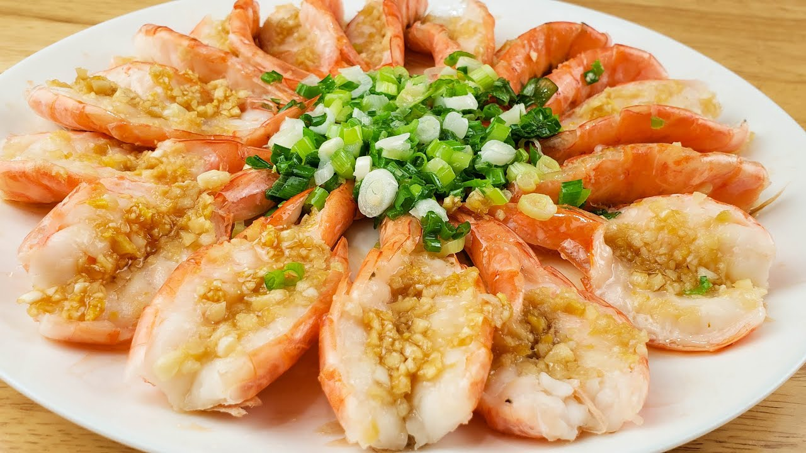

## 10) 蒜蓉粉丝蒸虾 Prawn & Rice Noodle Steam (ပုဇွန်နဲ့ ကြာဇံပေါင်း)

1. **EN**: Butterfly prawn backs. Mash garlic with salt; mix with soy. Soak rice noodles in hot water; drain.  
   **MY**: ပုဇွန် ကိုယ်လယ်ပိုင်း ခုတ်ဖျော့။ ကြက်သွန်ဖြူကို ဆားနဲ့ ထောင်းပြီး ပဲငံပြာရည် အကျဲနဲ့ နယ်။ ကြာဇံ ရေနွေး စိမ် ဆယ်။  
   **ZH**: 虾开背,取出虾线；蒜加盐捣碎拌一点点生抽；粉丝热水泡软沥干。

2. **EN**: Place prawns on noodles; top with mashed garlic; steam ~8 min.  
   **MY**: ကြာဇံအပေါ် ပုဇွန် ထား၊ ထောင်းသဖြူ လူးပေး၊ ၈ မိနစ် အမာပေါင်း။  
   **ZH**: 粉丝垫底摆虾，盖蒜蓉，上蒸约8分钟。

---
