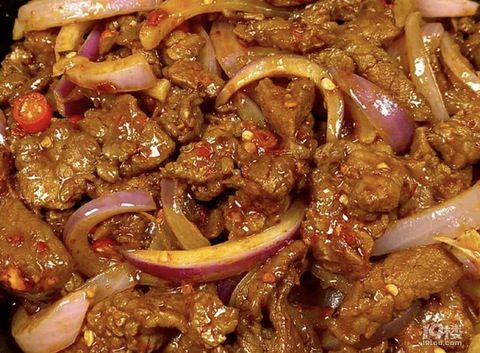

## 13) 孜然牛肉 Beef & Onion Fry (အမဲသားနဲ့ ကြက်သွန်ကြော်)

1. **EN**: Cut beef and onion into small chunks. Marinate beef with salt, soy, cumin powder, cooking wine, egg white.  
   **MY**: အမဲသား၊ ကြက်သွန်နီ ကို အတုံးသေးသေး လှီး။ အမဲသားကို ဆား၊ ပဲငံပြာရည်အကျဲ၊ ဇီယာမှုန့်၊ ဟင်းချက်အရက်၊ ကြက်ဥအကာ နှပ်။  
   **ZH**: 牛肉、洋葱切小块；牛肉以盐、生抽、孜然粉、料酒、蛋清腌制10分钟以上。

2. **EN**: Fry beef; remove. Sauté garlic, long onion, ginger; add big onion; season with salt, soy; return beef; add cumin powder; off heat add MSG & sesame oil.  
   **MY**: အမဲသား ကြော် ဆယ် → ကြက်သွန်ဖြူ၊ ဂျင်း၊ ကြက်သွန်မြိတ် ကြော် → ကြက်သွန်နီ ထည့် → ဆား၊ ပဲငံပြာရည်အကျဲ → အမဲသား ပြန်ထည့် → ဇီယာမှုန့် → မီးပိတ် အချိုမှုန့်၊ နှမ်းဆီ။  
   **ZH**: 牛肉快炒出锅→炒蒜姜葱→下洋葱→调盐生抽→回锅牛肉→加孜然→关火加味精香油。

---
