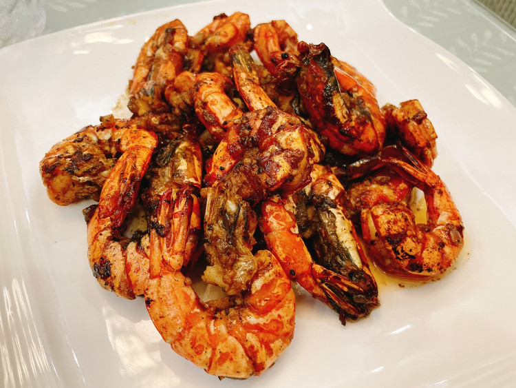

## 18) 黑椒虾 Prawn with Black Pepper (ပုဇွန်နဲ့ ငရုပ်ကောင်း)

1. **EN**: Pan‑fry prawns on both sides; remove. Sauté ginger, onion, garlic; add prawns and black pepper; add cooking wine, salt, MSG, soy, and some water; boil 3 min; reduce until nearly dry; finish with more black pepper.  
   **MY**: ပုဇွန် နှစ်ဖက် ကြော် ဆယ် → ဂျင်း၊ ကြက်သွန်မြိတ်၊ ကြက်သွန်ဖြူ ကြော် → ပုဇွန်၊ ငရုပ်ကောင်း ထည့် → ဟင်းချက်အရက်၊ ဆား၊ အချိုမှုန့်၊ ပဲငံပြာရည်အကျဲ၊ ရေ ထည့် → ၃ မိနစ်တည် → ရေခမ်းလောက်လာသော် ကျန် ငရုပ်ကောင်း ထည့်။  
   **ZH**: 虾开背去虾线，两面煎香后取出；爆香姜葱蒜，回锅虾与黑胡椒粉（可以现磨或者用预制的黑椒粉）；加料酒、盐、味精、生抽与少量水，煮3分钟；收至干香，最后再撒黑胡椒。

---
