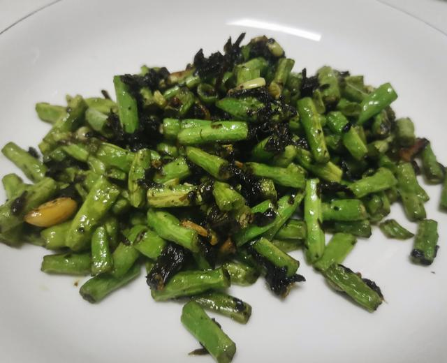

## 1) 橄榄菜炒豇豆 Long Bean Fry (ပဲတောင့်ရှည်ကြော်)

1. **EN**: First deep-fry the long beans in hot oil, then remove.  
   **MY**: အရင်ဆုံး ပဲသီးကို ဆီပူပူလေးနဲ့ ကြော်ပြီး ဆယ်ထားမယ်။  
   **ZH**: 先把豇豆在热油里炸熟，捞出备用。

2. **EN**: Sauté onion and garlic; add “AAA” brand sauce and fry.  
   **MY**: ပြီးရင် ကြက်သွန်ဖြူ၊ ကြက်သွန်မြိတ်ကို ကြော်ပြီး “AAA” တံဆိပ် အနှစ်ထည့် ကြော်မယ်။  
   **ZH**: 下葱蒜炒香，加入 “AAA” 品牌酱（橄榄菜酱）料翻炒。

3. **EN**: Return long beans; season with salt and soy; stir‑fry. Turn off heat, add MSG and sesame oil.  
   **MY**: ပြီးရင် ပဲသီး၊ ဆား၊ ပဲငံပြာရည်အကျဲ ထည့်ပြီး ကြော်မယ်။ မီးပိတ်၊ အချိုမှုန့်နဲ့ နှမ်းဆီ ထည့်မယ်။  
   **ZH**: 放回豇豆，加入食盐与生抽翻炒；关火后加味精和香油。

---
