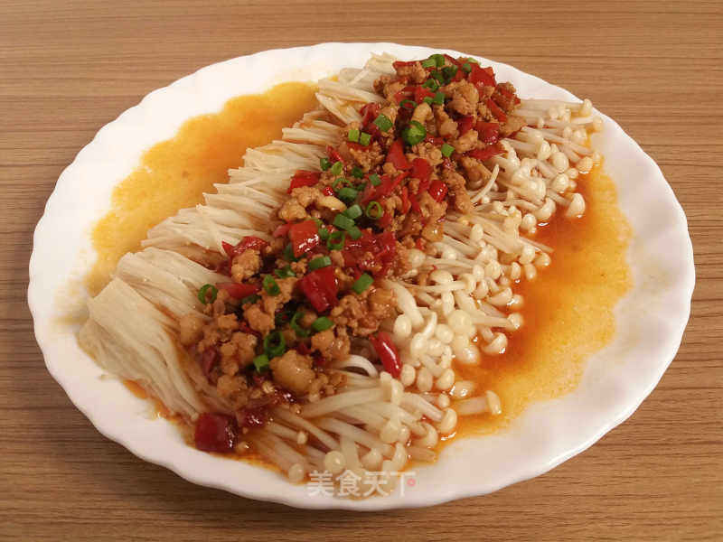

## 23) 剁椒牛肉 Needle Mushroom with Beef (အပ်မှိုနဲ့ အမဲသား)

1. **EN**: Marinate beef with salt and cornstarch. Sauté ginger, garlic, onion; add beef, cooking wine, soy; add mushrooms, water, and salt; cook 5 min; finish with MSG & sesame oil.  
   **MY**: အမဲသားကို ဆား၊ ပြောင်းကော်မှုန့် နဲ့ နှပ် → ဂျင်း၊ ကြက်သွန်ဖြူ၊ ကြက်သွန်ရှည် ကြော် → အမဲသား ထည့်၊ ဟင်းချက်အရက်၊ ပဲငံပြာရည်အကျဲ → မှို၊ ရေ၊ ဆား → ၅ မိနစ် အုပ် → အချိုမှုန့်၊ နှမ်းဆီ။  
   **ZH**: 牛肉用盐、料酒腌制10分钟以上，下锅前少量淀粉、油定型；爆香姜蒜葱剁椒碎 ，下牛肉加料酒、生抽；加金针菇、水、盐焖5分钟；加味精香油。

---
