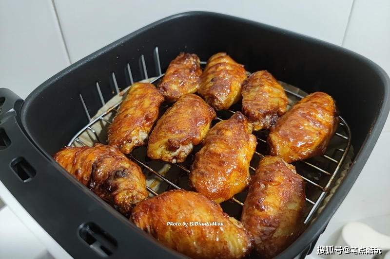

## 24) 空气炸锅炸鸡翅 Steamed & Roasted Chicken Wings (ကြက်တောင်ပံကင်)

1. **EN**: Marinate wings with onion, long onion, ginger, garlic, salt, oyster sauce, soy, cooking wine for 20 min.  
   **MY**: ကြက်တောင်ပံကို ကြက်သွန်နီ၊ ကြက်သွန်ရှည်၊ ဂျင်း၊ ကြက်သွန်ဖြူ၊ ဆား၊ ပဲငံပြာရည်အပျစ်၊ ပဲငံပြာရည်အကျဲ၊ ဟင်းချက်အရက် နဲ့ ၂၀ မိနစ်နှပ်။  
   **ZH**: 鸡翅以洋葱、葱、姜、蒜、盐、蚝油、生抽、料酒腌20分钟。

2. **EN**: Steam 10 min; dust with chicken flour (breading). Roast 15 min; toss with chili powder and cumin.  
   **MY**: ၁၀ မိနစ် ပေါင်းပြီး ကြက်သားဂျုံကပ်၊ ထို့နောက် ၁၅ မိနစ် ကင်၊ ငရုပ်မှုန့်နှင့် ဇီယာမှုန့် နယ်။  
   **ZH**: 先蒸10分钟，裹粉；再放入空气炸锅180度15分钟；拌辣椒粉和孜然粉装盘。

---
