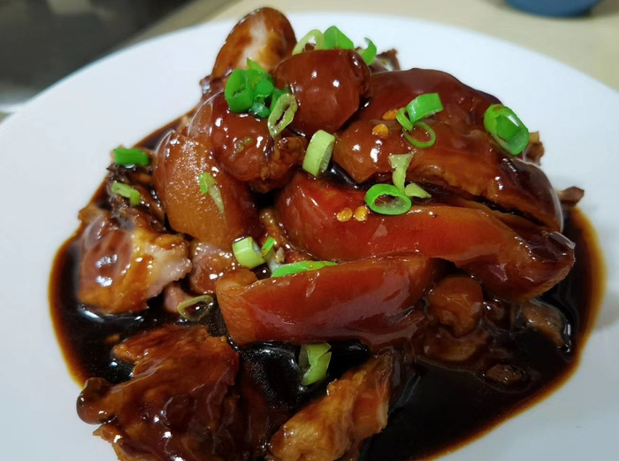

## 25) 炖猪肘 Pork Leg (၀က်ခြေထောက်)

1. **EN**: Fire‑roast the skin to remove hair/black bits; scrub clean. Parboil with ginger and long onion for 15 min; remove.  
   **MY**: မီးနဲ့ ကင်၍ အမဲအမ စွန့်ဖယ်၊ ဂျင်း၊ ကြက်သွန်ရှည် နဲ့ ၁၅ မိနစ် ပြုတ်ပြီး ဆယ်။  
   **ZH**: 火烤去毛后洗去黑渍；与姜葱汆煮15分钟后取出。

2. **EN**: Stir‑fry aromatics (ginger, long onion, dried chili, lemon), star anise, cinnamon, Sichuan pepper; caramelize brown sugar; add soy, salt, water; braise ~50 min.  
   **MY**: ဂျင်း၊ ကြက်သွန်ရှည်၊ ငရုပ်သီးခြောက်၊ လီမွန်၊ စမုန်စပါး၊ သစ်ကြံပိုးခေါက်၊ ငရုပ်ကောင်းစေ့၊ သကြား အညိုရောင် သန်းအောင် ကြော် → ပဲငံပြာရည်အကျဲ၊ ဆား၊ ရေ ထည့် → ~၅၀ မိနစ် ပေါင်း/ချက်။  
   **ZH**: 爆香姜葱干辣椒柠檬、八角、桂皮、花椒；炒糖色；加生抽、盐与水，小火焖约50分钟（如果有老汤直接使用老汤，加一半调料）。

---
