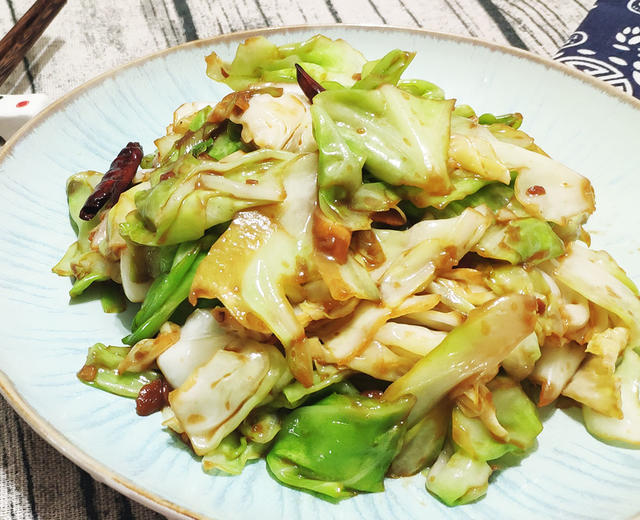

## 26) 酱爆洋白菜 Cabbage Fry (ဂေါ်ဖီကြော်)

1. **EN**: Stir‑fry cabbage and remove. Sauté long onion; add sweet soybean paste; return cabbage; add salt; off heat add MSG and sesame oil.  
   **MY**: ဂေါ်ဖီ ကြော် ဆယ် → ကြက်သွန်ရှည် ကြော် → ပဲပိစပ်အနှစ် ထည့် → ဂေါ်ဖီ ပြန်ထည့် → ဆား ထည့် → မီးပိတ် အချိုမှုန့်၊ နှမ်းဆီ။  
   **ZH**: 炒包菜盛出；炒葱，加甜面酱；回锅包菜（控水），加盐、生抽；关火加味精与香油（注意包菜尽量保持干燥）。

---
