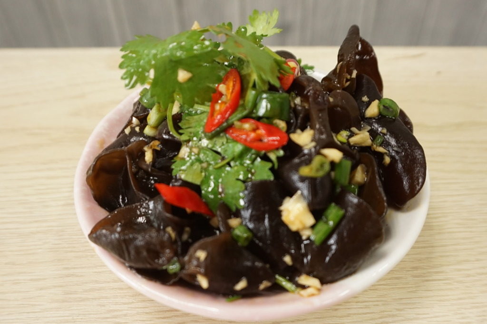

## 27) 凉拌木耳 Black Fungus Salad (ကြွက်နားရွက်)

1. **EN**: Boil black fungus with onion; drain. Season with soy, salt, vinegar. Heat oil with green chili & long onion; pour over and toss.  
   **MY**: ကြွက်နားရွက် နဲ့ ကြက်သွန်နီ ပြုတ် ဆယ် → ပဲငံပြာရည်အကျဲ၊ ဆား၊ ရှာလကာ ရည် ထည့် → ဆီ ပူပူလေးနဲ့ ငရုပ်စိမ်း၊ ကြက်သွန်အရှည် ကြော်ပြီး အပေါ်လောင်း နယ်။  
   **ZH**: 木耳与洋葱焯熟沥干；加生抽、盐、醋调味；热油爆小米辣碎与小葱，泼在上面拌匀。

---
