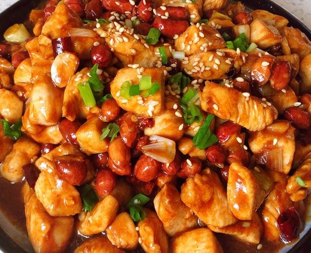

## 2) 宫保鸡丁 Chicken, Carrot, Cucumber Stir‑Fry (ကြက်သား၊ ဥနီ၊ သခွားသီးကြော်)

**Marinade & Sauce**  
- **EN**: Marinate chicken with soy, salt, Chinese cooking wine (hua tiao chiew), and cornstarch.  
  **MY**: ကြက်သားကို ပဲငံပြာရည်အကျဲ၊ ဆား၊ ဟင်းချက်အရက်၊ ပြောင်းကော်မှုန့် နဲ့ နယ်ထားမယ်။  
  **ZH**: 鸡肉用生抽、盐、花雕酒腌制10分钟，下锅前加入玉米淀粉定型。

- **EN**: Mix sauce: soy, cooking wine, salt, MSG, cornstarch, and some water.  
  **MY**: ပဲငံပြာရည်အကျဲ၊ ဟင်းချက်အရက်၊ ဆား၊ အချိုမှုန့်၊ ပြောင်းကော်မှုန့် ကို အေးရေနည်းနည်းထည့် ဖျော်ထားမယ်။  
  **ZH**: 调汁：生抽、醋、盐、味精、淀粉，糖一勺，加少量清水。

**Cooking**  
1. **EN**: Fry peanuts; remove. Fry chicken; remove.  
   **MY**: မြေပဲ လှော်ပြီး ဆယ်၊ ထို့နောက် ကြက်သား ကြော်ပြီး ဆယ်။  
   **ZH**: 先炸花生捞出；再煎炒鸡肉取出。

2. **EN**: Sauté ginger, garlic, onion, and dried chili. Add cucumber and carrot; stir‑fry.  
   **MY**: ဂျင်း၊ ကြက်သွန်ဖြူ၊ ကြက်သွန်မြိတ်၊ ငရုပ်သီးခြောက် ကြော်။ သခွားသီး၊ ဥနီ ထည့် ကြော်။  
   **ZH**: 炒姜蒜葱与干辣椒，加入黄瓜、胡萝卜翻炒至炒熟。

3. **EN**: Return chicken; add sauce and stir‑fry. Add peanuts; finish with sesame oil.  
   **MY**: ကြက်သား ပြန်ထည့်၊ အရည် (ဆော့စ်) လောင်းကြော်။ မြေပဲ ထည့်၊ မီးပိတ်ပြီး နှမ်းဆီ ထည့်။  
   **ZH**: 倒回鸡肉翻炒，后淋入调好的酱汁（淋入之前需要搅匀）翻炒；关火后淋香油最后加入花生翻炒几下出锅。

---
