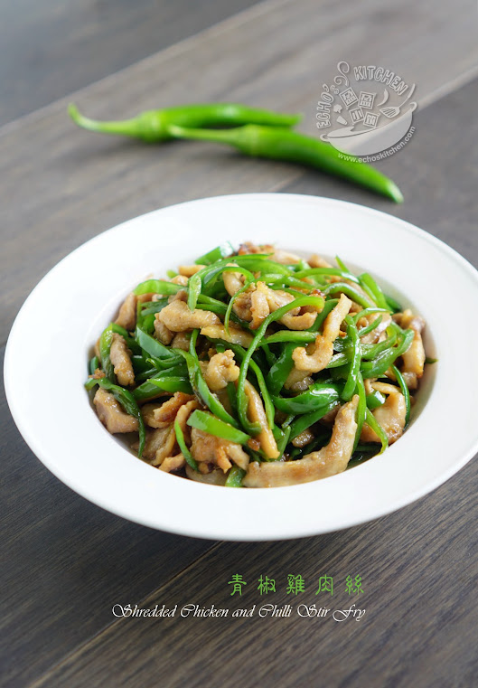

## 3) 青椒鸡丝 Chicken with Green Chili (ကြက်သားနဲ့ ငရုပ်သီးစိမ်းကြော်)

1. **EN**: Marinate chicken with soy, salt, cooking wine, cornstarch, and a little oil. Fry chicken; remove.  
   **MY**: ကြက်သားကို ပဲငံပြာရည်အကျဲ၊ ဆား၊ ဟင်းချက်အရက်၊ ပြောင်းကော်မှုန့်၊ ဆီနည်းနည်း နဲ့ နယ်ထားပြီး ကြော် ဆယ်။  
   **ZH**: 鸡胸肉切丝，以生抽、盐、料酒、淀粉、少许油腌10分钟，煎炒后盛出。

2. **EN**: Sauté ginger, garlic, onion. Return chicken; add green chili. Season with soy, salt, oyster sauce.  
   **MY**: ဂျင်း၊ ကြက်သွန်ဖြူ၊ ကြက်သွန်မြိတ် ကြော်။ ကြက်သား ပြန်ထည့်၊ ငရုပ်သီး ထည့်။ ဆား၊ ပဲငံပြာရည်အကျဲ၊ ပဲငံပြာရည်အပျစ် ထည့်။  
   **ZH**: 炒姜蒜葱，放回鸡丝，加青椒；以盐、生抽、蚝油调味。

3. **EN**: Turn off heat; add MSG and sesame oil.  
   **MY**: မီးပိတ်ပြီး အချိုမှုန့် နဲ့ နှမ်းဆီ ထည့်။  
   **ZH**: 关火后加味精与香油。

---
