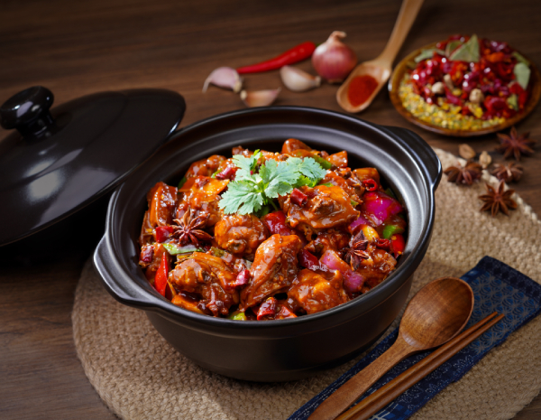

## 4) 香港鸡煲 Chicken Pot (Braised Chicken Stew) (ကြက်သားဟင်း)

1. **EN**: Marinate chicken with oyster sauce, cooking wine, salt, soy, and cornstarch for 20 min.  
   **MY**: ကြက်သားကို ပဲငံပြာရည်အပျစ်၊ ဟင်းချက်အရက်၊ ဆား၊ ပဲငံပြာရည်အကျဲ၊ ပြောင်းကော်မှုန့် နဲ့ မိနစ် ၂၀ နှပ်။  
   **ZH**: 鸡腿剁成4cm左右的块，以蚝油、料酒、盐、生抽、腌 30 分钟以上，烹饪前加入淀粉定型。

2. **EN**: Prep big onion, mushroom, green chili, garlic, ginger, potato, carrot.  
   **MY**: ကြက်သွန်နီ၊ မှို၊ ငရုပ်သီးစိမ်း၊ ကြက်သွန်ဖြူ၊ ဂျင်း၊ အာလူး၊ ဥနီ ကို လှီးပြင်။  
   **ZH**: 备洋葱、蘑菇、青椒、蒜、姜。

3. **EN**: Fry chicken pieces one by one; remove.  
   **MY**: ကြက်သားကို တစ်ခုချင်း ထည့်ကြော်ပြီး ဆယ်။  
   **ZH**: 鸡肉分批煎至焦黄取出。

4. **EN**: Sauté aromatics (ginger, garlic, half onion), bay leaves, dried chilies, Sichuan pepper, star anise. Return chicken; add half green chili; add 2 tbsp sugar, soybean paste, oyster sauce; add water. Season with salt, light soy, hoisin; add mushroom, potato, carrot; simmer ~15 min until slightly reduced. Finish with remaining onion & green chili; off heat add a little sesame oil.  
   **MY**: ဂျင်း၊ ကြက်သွန်ဖြူ၊ ကြက်သွန်နီတစ်ဝက်၊ လေးညှင်းပွင့်၊ ငရုပ်သီးခြောက်၊ ငရုပ်ကောင်းစေ့၊ စမုန်စပါး ကြော် → ကြက်သား ပြန်ထည့် → ငရုပ်သီးစိမ်း တစ်ဝက် ထည့် → သကြား ၂ ဇွန်း၊ ပဲပိစပ်၊ ပဲငံပြာရည်အပျစ် ထည့် → ရေထည့် → ဆား၊ ပဲငံပြာရည်အကျဲ၊ hoisin sauce ထည့် → မှို၊ အာလူး၊ ဥနီ ထည့် ၁၅ မိနစ် နပ် → ရေဆီနည်းနည်း ခမ်းလာရင် ကျန် ကြက်သွန်နီ၊ ငရုပ်သီးစိမ်း ထည့် → မီးပိတ်၊ နှမ်းဆီ နည်းနည်း ထည့်။  
   **ZH**: 炒香姜蒜半个洋葱、桂皮、干辣椒、花椒、八角；回锅鸡肉，入半量青椒；加白糖2勺、黄豆酱、李锦记海鲜酱、蚝油炒至上色。加水，再以盐、生抽调味；加蘑菇、小火焖约20分钟至略收汁；加入余下洋葱与青椒，关火淋少许香油收汁。

---
