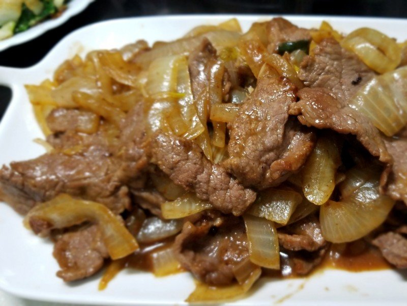

## 9) 洋葱炒牛肉 Beef & Onion (အမဲသားနဲ့ ကြက်သွန်)

1. **EN**: Slice beef thin; marinate with salt, soy, cooking wine, and egg white. Fry beef; remove.  
   **MY**: အမဲသား ပါးပါးလှီး၊ ဆား၊ ပဲငံပြာရည်အကျဲ၊ ဟင်းချက်အရက်၊ ကြက်ဥအကာ နဲ့ နှပ်၊ ကြော်ပြီး ဆယ်။  
   **ZH**: 牛肉切薄片用盐、生抽、料酒、蛋清抓腌10分钟以上，快炒后盛出。

2. **EN**: Sauté ginger and onion; add beef; season with oyster sauce, a little salt and soy. Off heat add MSG and sesame oil.  
   **MY**: ဂျင်း၊ ကြက်သွန်နီ ကြော် → အမဲသား ထည့် → ပဲငံပြာရည်အပျစ်၊ ဆား၊ ပဲငံပြာရည်အကျဲ → မီးပိတ် အချိုမှုန့်၊ နှမ်းဆီ။  
   **ZH**: 炒姜与洋葱，回锅牛肉；加蚝油、少许盐与生抽；关火加味精与香油。

---
